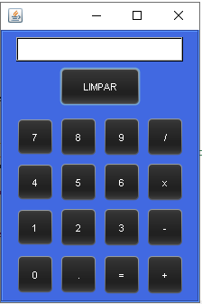

# :computer: Projeto: Calculadora

Este é um projeto de conclusão do curso de Introdução à Lógica de Programação oferecido pela Pacetech - Infinite Learning.

:man_student:Turma 4

:green_book:Período: 02/2022 - 04/2022 (3 meses)

## Descrição do projeto

> O objetivo deste projeto é a criação de uma calculadora utilizando a linguagem de programação Java (18). 
>
> A interface foi construída com JFrame (Swing).

### Funcionamento:

> A calculadora possibilita a execução das operações matemáticas entre números inteiros e racionais de soma, subtração, multiplicação e divisão.
>
> Ao clicar em um número, o mesmo será exibido na parte superior da interface, acima do botão "LIMPAR".
>
> Após a inclusão do primeiro número, basta selecionar o operador e, na sequência, o segundo número. Para operações com mais de dois números, o procedimento segue a mesma ordem: primeiro o número, depois o operador. 
>
> **Operadores**
>
> (/) divisão
>
> (x) multiplicação
>
> (-) subtração
>
> (+) adição
>
> O resultado da operação é obtido ao clicar no botão de símbolo "=" e o símbolo "." deve ser utilizado para números racionais.
>
> **LIMPAR** 
>
> Para corrigir um número informado, reiniciar ou realizar nova operação, clique no botão "LIMPAR".
>
> 

### Agradecimento:

:man_technologist: **Pacetech - Infinite Learning**

Conheça os cursos da Pacetech (Introdução à Programação, Java + Banco de Dados, Inglês para TI):

:link:[Pacetech](https://www.pacetech.com.br/)

